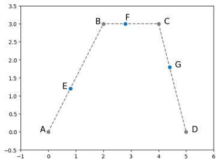
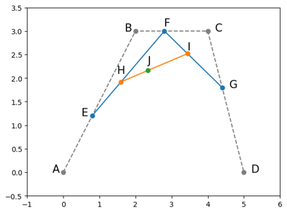
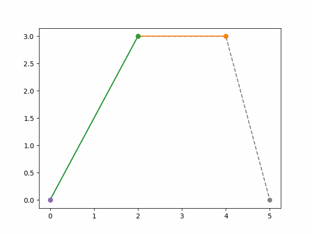
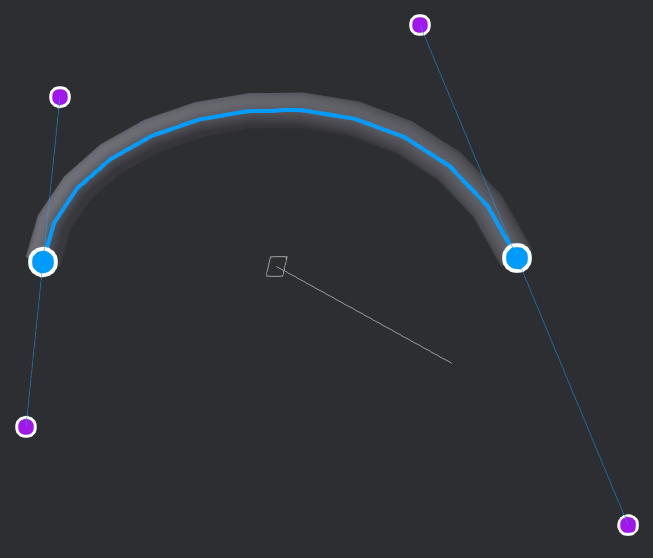
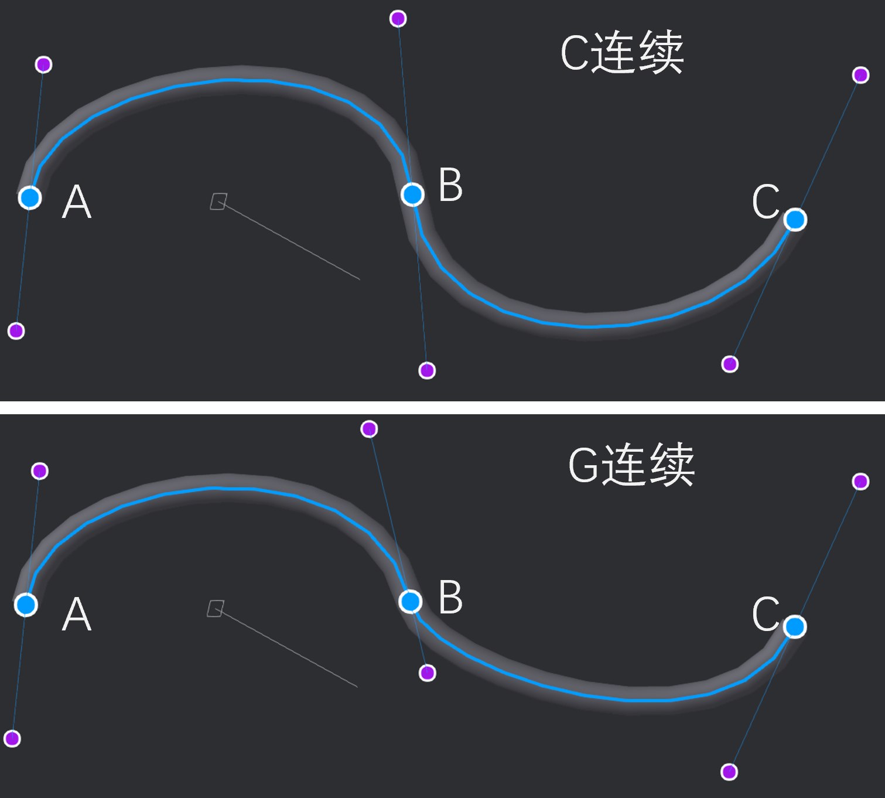
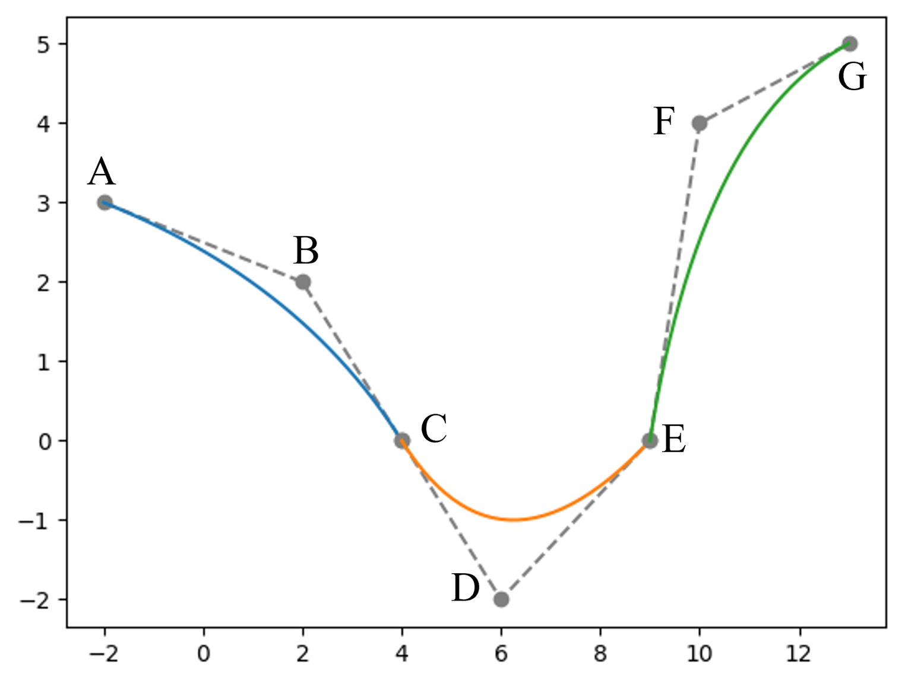
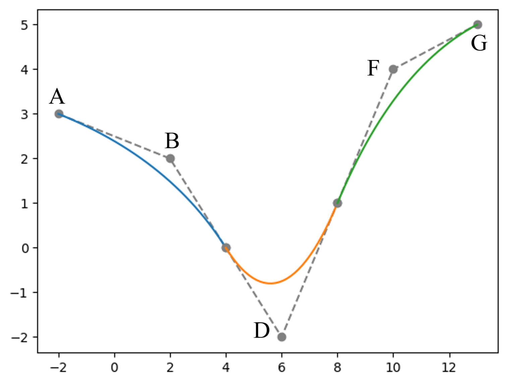
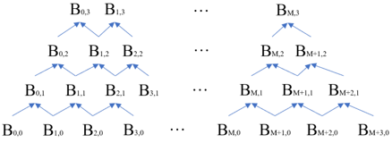
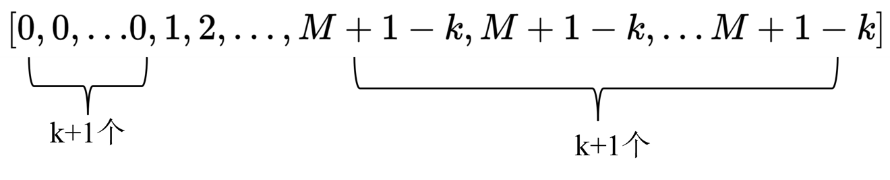
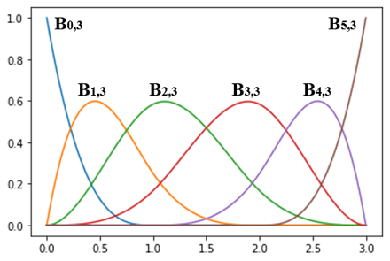

# Introduction of Bezier Curve \& B-Spline
## 1.Bezier Curve 贝塞尔曲线

如图1所示，给定4个控制点，A=(0,0), B=(2,3), C=(4,3), D=(5,0)。

点E,F,G分别为线段AB,线段BC和线段CD上的动点，满足：

$$
t=\frac{AE}{AB}=\frac{BF}{BC}=\frac{CG}{CD}
$$

点H,I分别为线段EF和线段FG上的动点，点J为线段HI上的动点，如图2所示，满足：

$$
t=\frac{AE}{AB}=\frac{BF}{BC}=\frac{CG}{CD}=\frac{EH}{FG}=\frac{HJ}{HI}
$$

则动点J的轨迹就是根据A,B,C,D四个控制点生成的cubic bezier curve。如图3所示。

上面以上面的例子为例，推导Bezier Curve的表达式。首先，很容易能得到下面这些表达式。

$$
\begin{array}{l}
E(t)=(1-t)\cdot A+ t\cdot B\\
F(t)=(1-t)\cdot B+ t\cdot C\\
G(t)=(1-t)\cdot C+ t\cdot D\\
H(t)=(1-t)\cdot E(t)+t\cdot F(t)\\
I(t)=(1-t)\cdot F(t)+t\cdot G(t)\\
J(t)=(1-t)\cdot H(t)+t\cdot I(t)
\end{array}
$$

处理下可得：

$$
J(t)=(1-t)^3\cdot A+3t(1-t)^2\cdot B+3t^2(1-t)\cdot C+t^3\cdot D \space\space,\space t\in [0,1]
$$

并且系数和为1，即：
$$
(1-t)^3+3t(1-t)^2+3t^2(1-t)+t^3=1
$$

推广下可知，n个控制点
$
(P_0,P_1,...,P_{n-1})
$
控制下的Bezier Curve的表达式为：
$$
Bezier(n,t)=\sum_{i=0}^{n-1}C_{n-q}^it^i(1-t)^{n-1-i}P_i \space\space,\space\space t\in[0,1]
$$

n个控制点得到的Bezier Curve是一个n-1阶的多项式。这个阶数即为Bezier Curve的阶数，或称为次数。进一步地，对上方的Bezier Curve表达式求导可得：
$$
Bezier'(n,t)=(n-1)\sum_{i=0}^{n-2}C_{n-2}^it^i(1-t)^{n-2-i}(P_{i+1}-P_i)\space\space,\space\space t\in[0,1]
$$

可见，这也是一条Bezier Curve。此外，这也给了我们一点思路，生成一条三次的Bezier Curve，可以给定4个控制点的坐标，还可以给定起始和终止两个点的坐标以及两个点的导数值。例如图4.

更多关于Bezier Curve的内容，请参考：
https://www.bilibili.com/video/BV1Eh411i7FQ/?spm_id_from=333.788.recommend_more_video.0&vd_source=6d488fb3fb2b6502eef001c88db2c742

## 2.B-Spline
Bezier Curve主要的缺点包括：

1) nonlocality，移动一个控制点会影响整条曲线；

2) 高阶曲线的话，曲线会离控制点特别远。

针对这些缺点的一种解决方法就是用多条Bezier曲线组合成一条曲线。曲线拼接的时候就有了C连续和G连续的区别。
- C连续是代数上的连续，parametric continuity，要求导数的方向和值都是一致的；
- G连续是几何上的连续，geometric continuity，只要求切向方向一致，不要求值一致。
  

图6所示为由3条2阶Bezier曲线组成的一条$C^0$连续曲线。其中C点既是第一条Bezier曲线(蓝色)的控制点，也是第二条Bezier曲线(黄色)的控制点。同样地，E点是第二条和第三条Bezier曲线的控制点。由于BCD共线且|BC|=|CD|，该曲线在B点处是$C^1$连续的，但是由于DEF不共线，在E点处是$C^0$连续的。如果想让该曲线为$C^1$连续，需要让DEF共线且|DE|=|EF|。进一步地，如果BCD共线但|BC|!=|CD|，那么曲线在C点处就是$G^1$连续的。

可见，N条二阶Bezier曲线共有3N个控制点，将它们拼接成一条$C^0$连续的曲线，需要N-1个控制点重合，那么剩下了3N-(N-1)=2N+1个控制点。如果要拼接成一条$C^1$连续的曲线，则需要再删除N-1个控制点，剩下了2N+1-(N-1)=N+2个控制点。对于图6的例子而言，由3条二阶Bezier曲线组成的B-spline曲线的控制点只包含A,B,D,F,G这5个点。

类似地，如果是N条3阶的Bezier曲线拼接的话，那么得到$C^0$连续曲线，需要4N-(N-1)=3N+1个控制点;$C^1$连续曲线需要3N+1-(N-1)=2N+2个控制点；$C^2$连续曲线需要2N+2-(N-1)=N+3个控制点。进而，N条k阶的Bezier曲线拼接，得到$C^{k-1}$连续曲线需要N+k个控制点。因为在CAD软件中，大多使用3阶均匀B样条曲线，下文主要以3阶均匀B样条为例说明如何通过给定控制点生成B样条曲线。

假设给定的控制点集合为：
$$
P=[P_0,P_1,...P_M]
$$

共M+1个控制点，则这就是一条由M-2条Bezier曲线组成的B样条曲线，表示为(其中3表示3阶)：

$$
B(t)=B_{0,3}(t)P_0+B_{1,3}(t)P_1+...+B_{M,3}(t)P_M\space\space,\space t\in[0,M-2]
$$

本文后续所介绍的Cox-de boor formula, aka. De Boor's Algorithm，是一种用递归得到系数$B_{0,3},B_{1,3}...$的方法。如图8所示。

首先要得到一个knot vector集合，这个集合可以用来表示每个$B_{i,3}$的有效范围，比如$B_{0,3}$只在$t\in[0,1]$这个区间内值不为0，其他t值时都为0，这就意味着$P_0$这个控制点无法在其他t值时对B样条曲线产生影响。即B样条允许曲线局部变化。计算均匀B样条的knot vector是：

这里举个具体的例子，假设k=3,M=5，则knot vector为$V=[0,0,0,0,1,2,3,3,3,3]$。其中：
- $B_{0,3}$的有效区间是[0,1]
- $B_{1,3}$的有效区间是[0,2]
- $B_{2,3}$的有效区间是[0,3]
- $B_{3,3}$的有效区间是[0,3]
- $B_{4,3}$的有效区间是[1,3]
- $B_{5,3}$的有效区间是[2,3]

cox-de boor计算公式为：
$$
B_{n,k}(t)=\frac{t-V_n}{V_{n+k}-V_n}B_{n,k-1}(t)+\frac{V_{n+k+1}-t}{V_{n+k+1}-V{n+1}}B_{n+1,k-1}(t)
$$

并且，

$$
B_{n,0}(t)=\begin{cases}
1,\space\space t\in[V_n,V_{n+1})
 \\
0,\space\space otherwise
\end{cases}
$$

如果$V_n=V_{n+1}$，则$B_{n,0}=0$。以及在计算过程中，如果分母为0，则对应的表达式部分也为0.

上方例子得到的系数曲线为：

(未完待续)

# Refs:

[1].https://wiki.freecad.org/B-Splines
